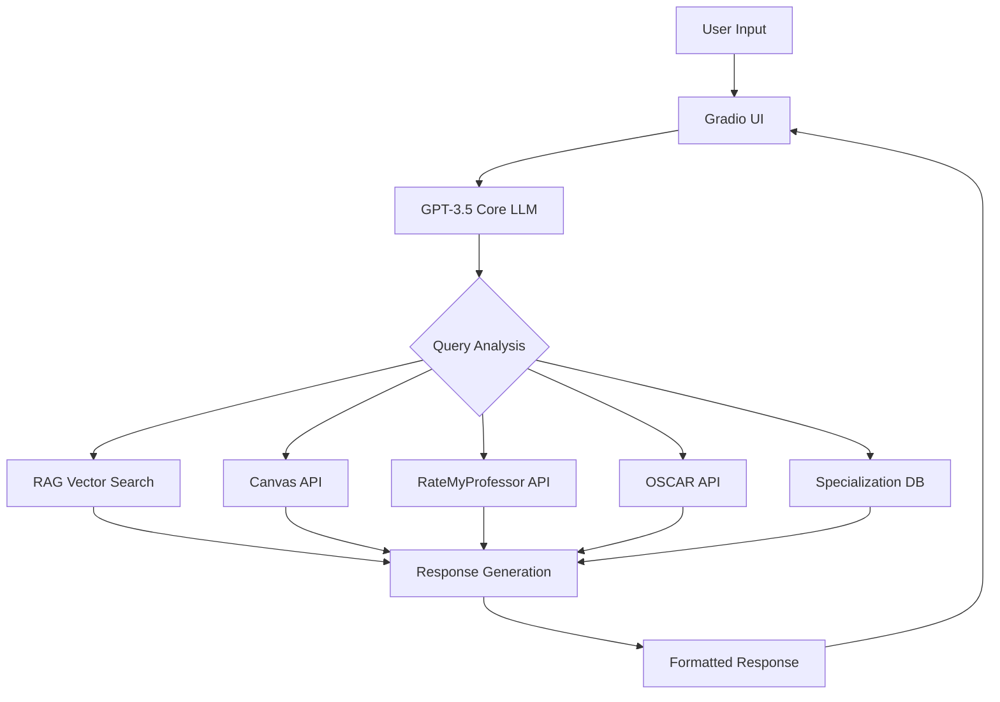

# 🤖 Reggie - Georgia Tech Registration Assistant

[](https://huggingface.co/spaces/RangDeBasanti/Reggie)
[](https://python.org)
[](https://openai.com)

> **An intelligent conversational AI assistant designed to help Georgia Tech students navigate the complexities of course registration, academic planning, and campus resources.**

Reggie combines the power of Large Language Models with real-time data integration to provide personalized, accurate, and contextually relevant support for Georgia Tech students during registration and beyond.

## 🌟 Key Features

### 📊 Real-Time Course Information
- **Live seat availability** for any course using CRN lookup
- **Waitlist status** and registration insights
- **Course scheduling** and conflict detection

### 👨‍🏫 Professor Insights
- **RateMyProfessor integration** for quality and difficulty ratings
- **Multi-professor comparisons** to help with course selection
- **Teaching style and workload insights**

### 📚 Academic Planning
- **Degree requirement tracking** for MSCS and other programs
- **Specialization guidance** and course recommendations
- **Graduation pathway planning**

### 📄 Document Intelligence
- **Syllabus analysis** - Upload PDFs for automatic parsing
- **Assignment tracking** and grade distribution extraction
- **Course comparison** across multiple syllabi

### 🔗 Canvas Integration
- **Personal assignment tracking** (local version only)
- **Course workload analysis**
- **Deadline management support**

### 🧠 Smart Knowledge Base
- **RAG-powered responses** using curated GT documents
- **FAQ handling** for common registration questions
- **Multi-turn conversations** with context retention

## 🚀 Quick Start

### Prerequisites
- Python 3.8 or higher
- OpenAI API key
- Canvas API key (optional, for personal features)
- Git LFS (for document storage)

### Installation

1. **Clone the repository**
   ```bash
   git clone https://github.com/en-jai-neer/reggie-gt-chatbot.git
   cd reggie-gt-chatbot
   ```

2. **Install Git LFS and pull documents**
   ```bash
   git lfs install
   git lfs pull
   ```

3. **Install dependencies**
   ```bash
   pip install -r requirements.txt
   ```

4. **Set up API keys**
   ```bash
   # Create API key files
   echo "your_openai_api_key_here" > OPENAI_KEY.txt
   echo "your_canvas_api_key_here" > CANVAS_KEY.txt  # Optional
   ```

5. **Build the RAG knowledge base**
   ```bash
   python RAG.py
   ```

6. **Launch the chatbot**
   ```bash
   python ChatbotUI.py
   ```

## 🏗️ Architecture



### Core Components

- **🧠 Base LLM**: OpenAI GPT-3.5 for natural language understanding and generation
- **📖 RAG System**: LangChain-powered document retrieval with vector similarity search
- **🔌 API Integrations**: Real-time data from multiple Georgia Tech systems
- **🎨 User Interface**: Gradio-based web application with file upload support
- **💾 Knowledge Base**: Curated collection of GT registration documents and FAQs

## 📊 Performance Results

Our evaluation shows Reggie significantly outperforms baseline ChatGPT:

| Metric | ChatGPT-3.5 | Reggie | Improvement |
|--------|-------------|--------|-------------|
| **Accuracy** | 4.7/10 | 7.45/10 | +58% |
| **Helpfulness** | 5.1/10 | 7.6/10 | +49% |
| **LLM Judge Score** | 5.8/10 | 7.25/10 | +25% |

*Based on evaluation with 20 Georgia Tech students and automated LLM assessment*

## 💡 Usage Examples

### Check Course Availability
```
User: "Are there available seats for CS 3600, CRN 30312?"
Reggie: "Based on current data, there are 3 seats available for CS 3600 with CRN 30312."
```

### Professor Comparison
```
User: "Compare the ratings for Professor Smith and Professor Johnson for CS 2340"
Reggie: "Professor Smith has a 4.2/5 quality rating with 2.8/5 difficulty, while Professor Johnson has a 3.8/5 quality rating with 3.5/5 difficulty..."
```

### Degree Planning
```
User: "What courses do I need for MSCS with Machine Learning specialization?"
Reggie: "For the MSCS Machine Learning specialization, you'll need: Core courses (CS 6601, CS 7641...), Electives (choose 2 from CS 7642, CS 8803...)..."
```

## 🛠️ Development

### Project Structure
```
reggie-gt-chatbot/
├── ChatbotUI.py          # Main application entry point
├── RAG.py                # RAG system setup and management
├── LLMEval.py           # Evaluation framework
├── RAG_data/            # Document knowledge base
├── eval_results/        # Performance evaluation results
├── requirements.txt     # Python dependencies
└── README.md           # This file
```

### Running Evaluations
```bash
# Run automated LLM evaluation
python LLMEval.py

# Results will be saved to eval_results/
```

### Adding New Documents
1. Place PDF documents in the `RAG_data/` folder
2. Run `python RAG.py` to rebuild the knowledge base
3. Restart the chatbot to load new information

## 🔒 Privacy & Security

- **FERPA Compliant**: No persistent storage of student data
- **Session-based**: All user data cleared when conversation ends
- **Secure API Keys**: Environment-based key management
- **No Personal Data Storage**: Canvas integration requires OAuth (planned)

## 🚧 Known Limitations

- Canvas API requires manual token setup (OAuth integration planned)
- Limited to MSCS degree requirements (expanding to other programs)
- Requires active internet connection for real-time features
- OpenAI API costs apply for usage

## 🔮 Future Enhancements

### Short Term
- [ ] OAuth2 integration for Canvas API
- [ ] Additional degree program support
- [ ] Improved conversational flow
- [ ] Enhanced error handling

### Long Term
- [ ] Multimodal input (images, voice)
- [ ] Advanced personalization
- [ ] Integration with official GT systems
- [ ] Mobile application
- [ ] Multilingual support

## 📚 Research & Evaluation

This project was developed as part of CS/ECE 8803 Conversational AI at Georgia Tech. Our research paper details:

- Comparative analysis with baseline models
- User study methodology and results
- Technical architecture decisions
- Future research directions

**Paper**: [ECE_8803R_Final_Project_Report.pdf](link-to-paper)

## 🔗 Links

- **Live Demo**: [HuggingFace Spaces](https://huggingface.co/spaces/RangDeBasanti/Reggie)
- **Course**: [CS/ECE 8803 Conversational AI]([https://www.cc.gatech.edu/](https://drive.google.com/file/d/1ifC7BWQk4LwTWSLzUpBv2Y7qu9mPYYbu/view))

## 💬 Support

For questions, issues, or suggestions:
- Open an [Issue](https://github.com/en-jai-neer/reggie-gt-chatbot/issues)
- Email me - jaisandeepjain@gmail.com
